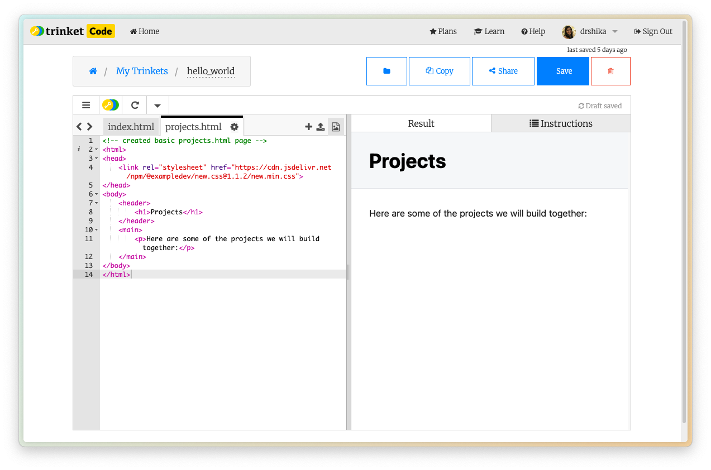
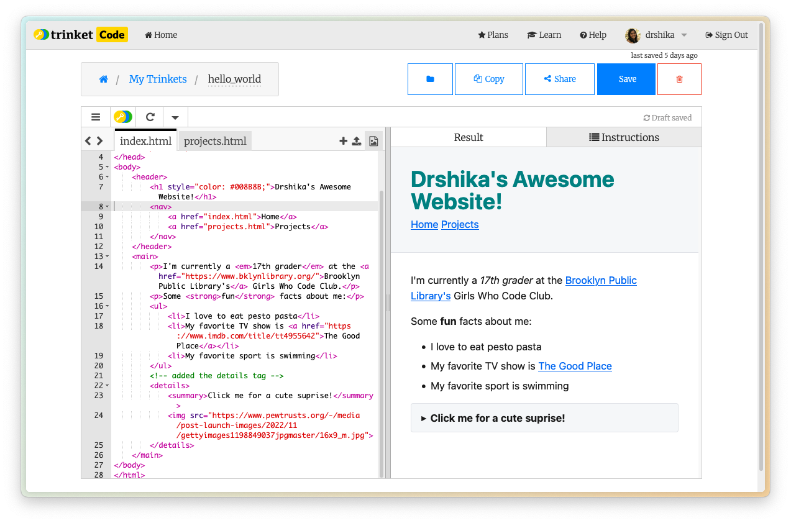

# Workshop #1 - HTML Hello World!
## Girls Who Code Club @ Dekalb Library

Today we're going to learn how to build a basic HTML website.

## Setup

1. Go to [Trinket](https://trinket.io/) and log in/sign up.

2. Navigate to the `home` page.
3. Click on the `+` button on the top left and select `New Project`.

4. Select `HTML` and name your project `hello_world`.

## What is HTML?

HTML, which stands for Hypertext Markup Language, helps to organize and categorize content on a website. HTML is made up of elements, which are represented by tags. Tags tell the browser how to display the content on the page. Tags also can have attributes, which are used to provide additional information about the element.

## How do you organize your content?

Sectioning tags help us create the larger structure of our website by dividing our content into sections (sort of like a beginning, middle, and end). We can use these tags to group elements together based on where they live on the webpage. All of the tags come in a **sandwich** so each opening tag should have a closing tag (but some of the tags self close, we will get to that later). 

- The `<body>` tag holds the content of an HTML document. There can only be one `<body>` tag.
- The `<nav>` tag holds the navigation bar in an HTML document.
- The `<header>` tag holds the introductory content in an HTML document.
- The `<main>` tag holds the dominant content of the `<body>` of an HTML document. There can only be one `<main>` tag on a page. We don't want to put anything in here that repeats on other pages, like the navigation bar.

## Simple HTML Structure

You should already have an index.html file created in your Trinket project. If you don't, you can create a new file by clicking the `+` button on the left sidebar and selecting `New file`. Then name it `index.html`.

1. Add the html tag: `<html>`
    - This is the root element of the HTML document.    
2. Add the body tag: `<body>`
    - This is the container for the content of the HTML document.
3. Add the main tag: `<main>`
    - The main element is the unique core content of that specific page. You can only have one main element per page.
4. Add your hello world inside the `<main></main>` tags.

```html
<html>
<body>
    <main>
        hello world
    </main>
</body>
</html>
```

That should look like this:


Congratulations! You've just created your first HTML document and said hello to the world! Now let's give your site a fun name.

## Styling

The website looks a bit plain right now. Let's add an external stylesheet to make it look a bit nicer.

Copy and paste this line to the head tag. This will load the external stylesheet when the page loads.
```html
<link rel="stylesheet" href="https://cdn.jsdelivr.net/npm/@exampledev/new.css@1.1.2/new.min.css">
```

- The `<head>` tag is used to specify the metadata of the HTML document.
- The `<link>` tag is used to link to an external stylesheet.
    - The link tag is a self closing tag.
- The `rel` attribute is used to specify the relationship between the current document and the linked resource.
- The `href` attribute is used to specify the URL of the linked resource.

And here's the code after adding the stylesheet:

```html
<html>
    <!-- Add these new stylesheet links in the head tag -->
    <head>
        <link rel="stylesheet" href="https://cdn.jsdelivr.net/npm/@exampledev/new.css@1.1.2/new.min.css">
    </head>
    <body>
        <main>
            hello world
        </main>
    </body>
</html>
```

## Adding a Title

Let's add our website title and give it a fun color. You can use a color picker to pick your favorite color: [w3 Schools Color Picker](https://www.w3schools.com/colors/colors_picker.asp)

- The `<header>` tag is used to create a header for the webpage.
- The `<h1>` tag is used to create a heading for the webpage.
    - The `style` attribute is used to specify the style of the element.
    - The `color` property is used to specify the color of the text.

```html
<html>
<head> 
    <link rel="stylesheet" href="https://cdn.jsdelivr.net/npm/@exampledev/new.css@1.1.2/new.min.css">
</head>
<body>
    <!-- added the header section and heading-->
    <header>
        <h1 style="color: #008B8B;">Drshika's Awesome Website!</h1>
    </header>
    <main>
        hello world
    </main>
</body>
</html>
```

That should look like this:


## Adding Content

We can also start to add some information to our webpage. Let's start by adding our school name and and some fun facts about ourselves.


- The `<p>` tag is used to create a paragraph of text.
- The `<a>` tag is used to create a hyperlink.  
- The `<ul>` tag is used to create an unordered list.
- The `<li>` tag is used to create a list item.
- The `<em>` tag is used to create an italic text.
- The `<strong>` tag is used to create a bold text.

here is the code after adding fun facts and info:
```html
<html>
<head>  
    <link rel="stylesheet" href="https://cdn.jsdelivr.net/npm/@exampledev/new.css@1.1.2/new.min.css">
</head>
<body>
    <header>
        <h1 style="color: #008B8B;">Drshika's Awesome Website!</h1>
    </header>
    <main>
        <!-- removed hello world, added the main section and the paragraphs -->
        <p>I'm currently a <em>17th grader</em> at the <a href="https://www.bklynlibrary.org/">Brooklyn Public Library's</a> Girls Who Code Club.</p>
        <p>Some <strong>fun</strong> facts about me:</p>
        <ul>
            <li>I love to eat pesto pasta</li>
            <li>My favorite TV show is <a href="https://www.imdb.com/title/tt4955642">The Good Place</a></li>
            <li>My favorite sport is swimming</li>
        </ul>
    </main>
</body>
</html>
```

That should look like this:


## Adding Images

The `` tag is used to embed an image in an HTML document. Let's add an image of our favorite animal to our webpage. Mine is a penguin. 

```html 

```

The image tag is a self closing tag.

And here's our code so far:

```html
<html>
<head>  
    <link rel="stylesheet" href="https://cdn.jsdelivr.net/npm/@exampledev/new.css@1.1.2/new.min.css">
</head>
<body>
    <header>
        <h1 style="color: #008B8B;">Drshika's Awesome Website!</h1>
    </header>
    <main>
        <p>I'm currently a <em>17th grader</em> at the <a href="https://www.bklynlibrary.org/">Brooklyn Public Library's</a> Girls Who Code Club.</p>
        <p>Some <strong>fun</strong> facts about me:</p>
        <ul>
            <li>I love to eat pesto pasta</li>
            <li>My favorite TV show is <a href="https://www.imdb.com/title/tt4955642">The Good Place</a></li>
            <li>My favorite sport is swimming</li>
        </ul>
        <!-- added the image tag -->
        
    </main>
</body>
</html>
```

That should look like this:


## Creating a new Page

To add another page to our website, we need to create a new HTML file. Let's create a new file called `projects.html`. Let's start by adding the basic HTML structure to the new page.

```html
<!-- created basic projects.html page -->
<html>
<head>
    <link rel="stylesheet" href="https://cdn.jsdelivr.net/npm/@exampledev/new.css@1.1.2/new.min.css">
</head>
<body>
    <header>
        <h1>Projects</h1>
    </header>
    <main>
        <p>Here are some of the projects we will build together:</p>
    </main>
</body>
</html>
```

That should look like this:



## Navigating between pages

To be able to navigate to the projects page, we need to add a link to the projects page from the *home* page. We can do this by adding the link within the `nav` tags in the `index.html` page. Within the `nav` tags, we can add a link to the projects page by using the `a` tag. I am also adding a link to the home page within the `nav` tags to stay consistent with the menu we will add to the `projects.html` page.

```html
<html>
<head>  
    <link rel="stylesheet" href="https://cdn.jsdelivr.net/npm/@exampledev/new.css@1.1.2/new.min.css">
</head>
<body>
    <header>
        <h1 style="color: #008B8B;">Drshika's Awesome Website!</h1>
        <!-- added the navigation menu -->
        <nav>
            <a href="index.html">Home</a>
            <a href="projects.html">Projects</a>
        </nav>
    </header>
    <main>
        <p>I'm currently a <em>17th grader</em> at the <a href="https://www.bklynlibrary.org/">Brooklyn Public Library's</a> Girls Who Code Club.</p>
        <p>Some <strong>fun</strong> facts about me:</p>
        <ul>
            <li>I love to eat pesto pasta</li>
            <li>My favorite TV show is <a href="https://www.imdb.com/title/tt4955642">The Good Place</a></li>
            <li>My favorite sport is swimming</li>
        </ul>
        
    </main>
</body>
</html>
```

That should look like this:


## Creating an Ordered list

Going back to the *projects* page, let's create an ordered list of the projects we will build together. Ordered lists are simmilar to create as unordered lists but the HTML tag you have to use is different. Let's also add the navigation menu to the `projects.html` page to get back to the home page.

- The `<ol>` tag is used to create an ordered list.
    - The `type` attribute is used to specify the type of list. I've chosen roman numerals for this list but you can choose from a variety of other types like `1`, `A`, `a`, `I`, `i`.
- The `<li>` tag is used to create a list item.

```html
<html>
<head>
    <link rel="stylesheet" href="https://cdn.jsdelivr.net/npm/@exampledev/new.css@1.1.2/new.min.css">
</head>
<body>
    <header>
        <h1>Projects</h1>
        <!-- added the navigation menu -->
        <nav>
            <a href="index.html">Home</a>
            <a href="projects.html">Projects</a>
        </nav>
    </header>
    <main>
        <p>Here are some of the projects we will build together:</p>
        <!-- added the ordered list of projects -->
        <ol type="I">
            <li>Girls Who Code Website</li>
            <li>Recipes Website</li>
        </ol>
    </main>
</body>
</html>
```

That should look like this:


## [BONUS] Interactive Elements

There are many ways to make your website interactive. HTML elements like `button`, `input`, and `select` (dropdowns) are some examples but all require some JavaScript to make them useful. 

For the scope of this workshop, we will use the `details` and `summary` tags to create an interactive element. Let's put our animal image into a suprise component that will show when the user clicks clicks to access the summary. 

- The `<details>` tag is used to create a details element.
- The `<summary>` tag is used to create a summary element.

```html
<html>
<head>  
    <link rel="stylesheet" href="https://cdn.jsdelivr.net/npm/@exampledev/new.css@1.1.2/new.min.css">
</head>
<body>
    <header>
        <h1 style="color: #008B8B;">Drshika's Awesome Website!</h1>
        <nav>
            <a href="index.html">Home</a>
            <a href="projects.html">Projects</a>
        </nav>
    </header>
    <main>
        <p>I'm currently a <em>17th grader</em> at the <a href="https://www.bklynlibrary.org/">Brooklyn Public Library's</a> Girls Who Code Club.</p>
        <p>Some <strong>fun</strong> facts about me:</p>
        <ul>
            <li>I love to eat pesto pasta</li>
            <li>My favorite TV show is <a href="https://www.imdb.com/title/tt4955642">The Good Place</a></li>
            <li>My favorite sport is swimming</li>
        </ul>
        <!-- put the image tag inside the details tag under the summary tag -->
        <details>
            <summary>Click me for a cute suprise!</summary>
            
        </details>
    </main>
</body>
</html>
```

That should look like this:



And here is a gif of the interactive element:


## Conclusion

You've just built your first HTML website! You can keep adding more and more elements to your website to make it more and more interesting. Here are some ideas:

- Add a video
- Change the styling (fonts, colors, background, etc.)
- Add a form

Hope you had fun! See you next time!

## Acknowledgements

- [New.css](https://newcss.net/)
- [Inter Font](https://fonts.google.com/specimen/Inter)
- [Penguin Image](https://www.pewtrusts.org/-/media/post-launch-images/2022/11/gettyimages1198849037jpgmaster/16x9_m.jpg)
- [Girls Who Code HTML Tutorial](https://girlswhocode.com/programs/code-at-home)
