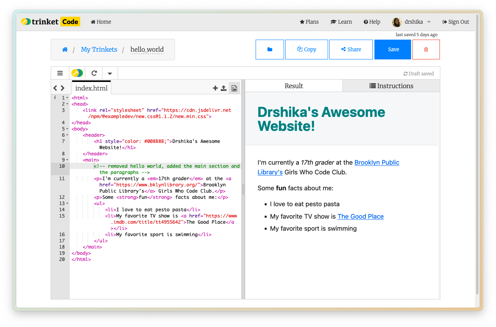
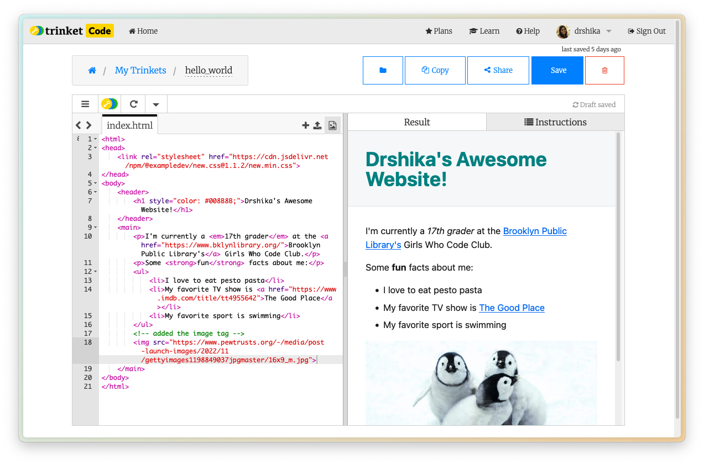

# Workshop #1 - HTML Hello World!
## Girls Who Code Club @ Dekalb Library

Today we're going to learn how to build a basic HTML website.

## Setup

1. Go to [Trinket](https://trinket.io/) and log in/sign up.

2. Navigate to the `home` page.
3. Click on the `+` button on the top left and select `New Project`.

4. Select `HTML` and name your project `hello_world`.

## What is HTML?

HTML, which stands for Hypertext Markup Language, helps to organize and categorize content on a website. HTML is made up of elements, which are represented by tags. Tags tell the browser how to display the content on the page. Tags also can have attributes, which are used to provide additional information about the element.

## How do you organize your content?

Sectioning tags help us create the larger structure of our website by dividing our content into sections (sort of like a beginning, middle, and end). We can use these tags to group elements together based on where they live on the webpage. All of the tags come in a **sandwich** so each opening tag should have a closing tag (but some of the tags self close, we will get to that later). 

- The `<body>` tag holds the content of an HTML document. There can only be one `<body>` tag.
- The `<nav>` tag holds the navigation bar in an HTML document.
- The `<header>` tag holds the introductory content in an HTML document.
- The `<main>` tag holds the dominant content of the `<body>` of an HTML document. There can only be one `<main>` tag on a page. We don't want to put anything in here that repeats on other pages, like the navigation bar.

## Simple HTML Structure

You should already have an index.html file created in your Trinket project. If you don't, you can create a new file by clicking the `+` button on the left sidebar and selecting `New file`. Then name it `index.html`.

1. Add the doctype declaration: `<!DOCTYPE html>`
    - This tells the browser that this is an HTML document.
2. Add the html tag: `<html lang="en">`
    - This is the root element of the HTML document. It also sets the language of the document to English.
3. Add the head tag: `<head>`
    - This is the container for the metadata of the HTML document.
4. Within the head tag, add the meta tag: `<meta charset="UTF-8">` and `<meta name="viewport" content="width=device-width, initial-scale=1.0">`
    - The charset attribute is used to specify the character encoding of the document.
    - The viewport attribute is used to specify the viewport of the document.
5. Add the body tag: `<body>`
    - This is the container for the content of the HTML document.
6. Add your hello world inside the `<body></body>` tags.

```html
<!DOCTYPE html>
<html lang="en">
<head>
    <meta charset="UTF-8">
    <meta name="viewport" content="width=device-width, initial-scale=1.0">
</head>
<body>
    <main>
        hello world
    </main>
</body>
```

That should look like this:


Congratulations! You've just created your first HTML document and said hello to the world! Now let's give your site a fun name.

## Adding a Title

The `<title>` tag is used to specify the title of the HTML document. You won't be able to see this on the trinket but it will be used to identify the page when you share it with others.

    ℹ️ I'll be using HTML comments <!-- --> to indicate what changes I'm making to the code moving forward. Each step will have the full code up till that step so if you get lost, you can always copy and paste the code from the previous step. 

```html
<!DOCTYPE html>
<html lang="en">
<head>
    <meta charset="UTF-8">
    <meta name="viewport" content="width=device-width, initial-scale=1.0">
    <!-- Add this title tag -->
    <title>Drshika's Awesome Website!</title>
</head>
<body>
    <main>
        hello world
    </main>
</body>
```

## Styling

The website looks a bit plain right now. Let's add an external stylesheet to make it look a bit nicer.

Copy and paste these two lines to the head tag. This will load the external stylesheet and font when the page loads.
```html
<link rel="stylesheet" href="https://cdn.jsdelivr.net/npm/@exampledev/new.css@1.1.2/new.min.css">
<link rel="stylesheet" href="https://fonts.xz.style/serve/inter.css">
```

Let's add our website title and give it a fun color.

- The `<header>` tag is used to create a header for the webpage.
- The `<h1>` tag is used to create a heading for the webpage.
    - The `style` attribute is used to specify the style of the element.
    - The `color` property is used to specify the color of the text.

```html
<!DOCTYPE html>
<html lang="en">
<head>
    <meta charset="UTF-8">
    <meta name="viewport" content="width=device-width, initial-scale=1.0">
    <title>Drshika's Awesome Website!</title>   
    <!-- Add these new stylesheet links -->
    <link rel="stylesheet" href="https://cdn.jsdelivr.net/npm/@exampledev/new.css@1.1.2/new.min.css">
    <link rel="stylesheet" href="https://fonts.xz.style/serve/inter.css">
</head>
<body>
    <header>
        <h1 style="color: #008B8B;">Drshika's Awesome Website!</h1>
    </header>
    <main>
    </main>
</body>
</html>
```

That should look like this:


## Adding Content

We can also start to add some information to our webpage. Let's start by adding our school name and and some fun facts about ourselves.

- The `<main>` tag is used to create the main content of the webpage.
- The `<p>` tag is used to create a paragraph of text.
- The `<a>` tag is used to create a hyperlink.  
    - The `href` attribute is used to specify the URL of the page to link to.
- The `<ul>` tag is used to create an unordered list.
- The `<li>` tag is used to create a list item.
- The `<em>` tag is used to create an italic text.
- The `<strong>` tag is used to create a bold text.

here is the code after adding fun facts and info:
```html
<!DOCTYPE html>
<html lang="en">
<head>
    <meta charset="UTF-8">
    <meta name="viewport" content="width=device-width, initial-scale=1.0">
    <title>Drshika's Awesome Website!</title>   
    <link rel="stylesheet" href="https://cdn.jsdelivr.net/npm/@exampledev/new.css@1.1.2/new.min.css">
    <link rel="stylesheet" href="https://fonts.xz.style/serve/inter.css">
</head>
<body>
    <header>
        <h1 style="color: #008B8B;">Drshika's Awesome Website!</h1>
    </header>
    <main>
        <p>I'm currently a <em>17th grader</em> at the <a href="https://www.bklynlibrary.org/">Brooklyn Public Library's</a> Girls Who Code Club.</p>
        <p>Some <strong>fun</strong> facts about me:</p>
        <ul>
            <li>I love to eat pesto pasta</li>
            <li>My favorite TV show is <a href="https://www.apple.com/tv-plus/series/severance/">Severance</a></li>
            <li>My favorite sport is swimming</li>
        </ul>
    </main>
</body>
</html>
```

That should look like this:



## Adding Images

The `` tag is used to embed an image in an HTML document. Let's add an image of our favorite animal to our webpage. Mine is a penguin. Make sure to add the `alt` attribute to the image. This information is important for people who use screen readers to navigate the web.

```html 

```

And here's our code so far:

```html
<!DOCTYPE html>
<html lang="en">
<head>
    <meta charset="UTF-8">
    <meta name="viewport" content="width=device-width, initial-scale=1.0">
    <title>Drshika's Awesome Website!</title>   
    <link rel="stylesheet" href="https://cdn.jsdelivr.net/npm/@exampledev/new.css@1.1.2/new.min.css">
    <link rel="stylesheet" href="https://fonts.xz.style/serve/inter.css">
</head>
<body>
    <header>
        <h1 style="color: #008B8B;">Drshika's Awesome Website!</h1>
    </header>
    <main>
        <p>I'm currently a <em>17th grader</em> at the <a href="https://www.bklynlibrary.org/">Brooklyn Public Library's</a> Girls Who Code Club.</p>
        <p>Some <strong>fun</strong> facts about me:</p>
        <ul>
            <li>I love to eat pesto pasta</li>
            <li>My favorite TV show is <a href="https://www.apple.com/tv-plus/series/severance/">Severance</a></li>
            <li>My favorite sport is swimming</li>
        </ul>
        
    </main>
</body>
</html>
```

That should look like this:



To add another page to our website, we need to create a new HTML file. Let's create a new file called `projects.html`. 

- The `<nav>` tag is used to create a navigation bar.
    - make sure to add the same navigation bar to the new page as well so that we can navigate between the pages.

```html
<!-- created the whole projects page -->
<!DOCTYPE html>
<html lang="en">
<head>
    <meta charset="UTF-8">
    <meta name="viewport" content="width=device-width, initial-scale=1.0">
    <title>Projects</title>
    <link rel="stylesheet" href="https://cdn.jsdelivr.net/npm/@exampledev/new.css@1.1.2/new.min.css">
    <link rel="stylesheet" href="https://fonts.xz.style/serve/inter.css">
</head>
<body>
    <header>
        <h1>Projects</h1>
        <nav>
            <a href="index.html">Home</a>
            <a href="projects.html">Projects</a>
        </nav>
    </header>
</body>
</html>
```


Now let's add a link in the navigation bar to the projects page from the index.html page.

```html
<!DOCTYPE html>
<html lang="en">
<head>
    <meta charset="UTF-8">
    <meta name="viewport" content="width=device-width, initial-scale=1.0">
    <title>Drshika's Awesome Website!</title>
    <link rel="stylesheet" href="https://cdn.jsdelivr.net/npm/@exampledev/new.css@1.1.2/new.min.css">
    <link rel="stylesheet" href="https://fonts.xz.style/serve/inter.css">
</head>
<body>
    <header>
        <h1 style="color: #008B8B;">Drshika's Awesome Website!</h1>
        <!-- Add this navigation section -->
        <nav>
            <a href="index.html">Home</a>
            <a href="projects.html">Projects</a>
        </nav>
    </header>
    <main>
        <p>I'm currently a <em>17th grader</em> at the <a href="https://www.bklynlibrary.org/">Brooklyn Public Library's</a> Girls Who Code Club.</p>
        <p>Some <strong>fun</strong> facts about me:</p>
        <ul>
            <li>I love to eat pesto pasta</li>
            <li>My favorite TV show is <a href="https://www.apple.com/tv-plus/series/severance/">Severance</a></li>
            <li>My favorite sport is swimming</li>
        </ul>
        
    </main>
</body>
</html>
```

That should look like this:


## HTML Element: Tables

The `<table>` tag is used to create a table. Let's add a table to our webpage to display some of the projects we will build together

- The `<tr>` tag is used to create a table row.
- The `<th>` tag is used to create a table header.
- The `<td>` tag is used to create a table cell.

```html
<!DOCTYPE html>
<html lang="en">
<head>
    <meta charset="UTF-8">
    <meta name="viewport" content="width=device-width, initial-scale=1.0">
    <title>Projects</title>
    <link rel="stylesheet" href="https://cdn.jsdelivr.net/npm/@exampledev/new.css@1.1.2/new.min.css">
    <link rel="stylesheet" href="https://fonts.xz.style/serve/inter.css">
</head>
<body>
    <header>
        <h1>Projects</h1>
        <nav>
            <a href="index.html">Home</a>
            <a href="projects.html">Projects</a>
        </nav>
    </header>
    <main>
        <table>
            <tr>
                <th>Project</th>    
                <th>Description</th>
            </tr>
            <tr>
                <td>Girls Who Code Website</td>
                <td>A website to showcase the projects we will build together!</td>
            </tr>
            <tr>
                <td>Recipes Website</td>
                <td>A collection of my favorite recipes!</td>
            </tr>
        </table>
    </main>
</body>
</html>
```

That should look like this:


## [BONUS] Adding a Button

HTML websites are static, meaning they don't have any interactivity. If we want the users to be able to interact with our website, we can use JavaScript. Let's make the cute animal picture a suprise when the user clicks on the button.

- The `<button>` tag is used to create a button.
- The `onclick` attribute is used to specify the JavaScript code to execute when the button is clicked.
    1. `document.getElementById('animal').style.display='block'` is used to display the image when the button is clicked.
    2. `display:none` is used to hide the image by default.
    

```html
<!DOCTYPE html>
<html lang="en">
<head>
    <meta charset="UTF-8">
    <meta name="viewport" content="width=device-width, initial-scale=1.0">
    <title>Drshika's Awesome Website!</title>
    <link rel="stylesheet" href="https://cdn.jsdelivr.net/npm/@exampledev/new.css@1.1.2/new.min.css">
    <link rel="stylesheet" href="https://fonts.xz.style/serve/inter.css">
</head>
<body>
    <header>
        <h1 style="color: #008B8B;">Drshika's Awesome Website!</h1>
        <!-- Add this navigation section -->
        <nav>
            <a href="index.html">Home</a>
            <a href="projects.html">Projects</a>
        </nav>
    </header>
    <main>
        <p>I'm currently a <em>17th grader</em> at the <a href="https://www.bklynlibrary.org/">Brooklyn Public Library's</a> Girls Who Code Club.</p>
        <p>Some <strong>fun</strong> facts about me:</p>
        <ul>
            <li>I love to eat pesto pasta</li>
            <li>My favorite TV show is <a href="https://www.apple.com/tv-plus/series/severance/">Severance</a></li>
            <li>My favorite sport is swimming</li>
        </ul>
        <button onclick="document.getElementById('animal').style.display='block'">Click me for cute suprise!</button>
        
    </main>
</body>
</html>
```

That should look like this:


And here's a video of the button in action!   


## Conclusion

You've just built your first HTML website! You can keep adding more and more elements to your website to make it more and more interesting. Here are some ideas:

- Add a form
- Add a video
- Change the styling (fonts, colors, background, etc.)

Hope you had fun! See you next time!

## Acknowledgements

- [New.css](https://newcss.net/)
- [Inter Font](https://fonts.google.com/specimen/Inter)
- [Penguin Image](https://www.pewtrusts.org/-/media/post-launch-images/2022/11/gettyimages1198849037jpgmaster/16x9_m.jpg)
- [Girls Who Code HTML Tutorial](https://girlswhocode.com/programs/code-at-home)
